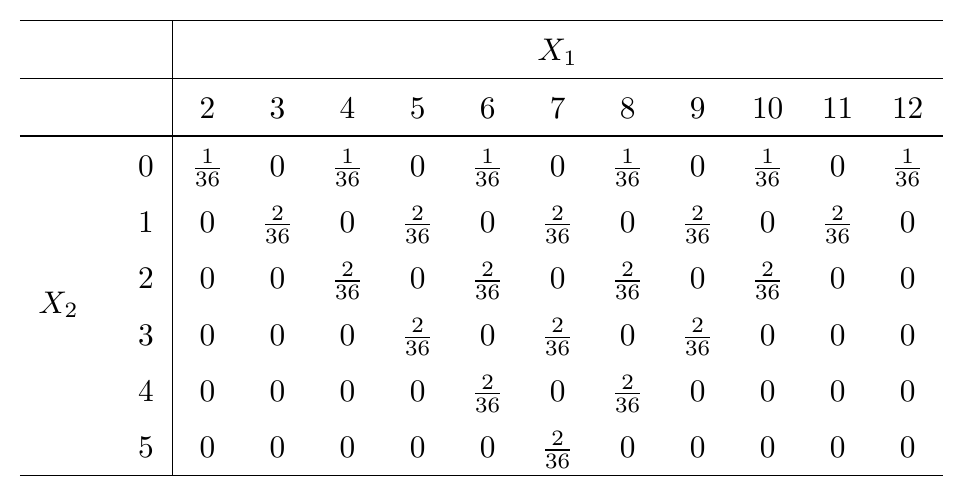

\newcommand\given[1][]{\:#1\vert\:}
\newcommand\P[1]{P{\left(#1\right)}}
\newcommand\F[1]{F_{\tiny{#1}}}
\newcommand\f[1]{f_{\tiny{#1}}}
\newcommand\p[1]{p_{\tiny{#1}}}
\newcommand\V[1]{\text{Var}\!\left(#1\right)}
\newcommand\E[1]{E\!\left(#1\right)}

## key point from end of last class, restated

I did: $X_1,\ldots,X_n$ i.i.d. implies $\E{\overline X} = \mu.$

A different (better?) approach could have started with a more fundamental:
$$\E{\sum\limits_{i=1}^n X_i} = \sum\limits_{i=1}^n \E{X_i}$$
which is true no matter what. (No independence required and all expected values can be different.)


## looking back: getting a sense of $E(X)=7.5$

```{r, echo=FALSE, fig.width=10, fig.height=5.5}
layout(matrix(1:4,2,2))
x <- seq(0, 15, by=0.1)
plot(x, dnorm(x, 7.5, 2), type="l", ylab="f(x)", main="N(7.5,1)")
abline(v=7.5, lty=2, col=2)

x <- 0:150/10
plot(x, dexp(x, 1/7.5), type="l", ylab="f(x)", main="Exp(1/(7.5))")
abline(v=7.5, lty=2, col=2)

x <- 0:25
plot(x, dbinom(x, 25, 0.3), ylab="p(k)", main="Binomial(25, 0.3)", pch=19)
abline(v=25*0.3, lty=2, col=2)

x <- 0:250/10
plot(x, dgamma(x, 3, rate=0.4), type="l", ylab="f(x)", main="Gamma(3, 0.4)")
abline(v=3/0.4, lty=2, col=2)
```


## putting a number on variation { .build }

Expected value is a measure of "location", but random variables with the same "location" can be quite different.

Consider the coin tossing game with $E(Y)=0$:
$$P(Y=y) = \begin{cases}
0.5 &: y=100\\
0.5 &: y=-100
\end{cases}$$

One thing leads to another. Family trees are compared and contrasted, and after more than a few *schnapps* things get interesting:
$$P(Y_2=y) = \begin{cases}
0.5 &: y=1000\\
0.5 &: y=-1000
\end{cases}$$
Still, $E(Y_2)=0$. But the values of $Y_2$ are more spread out.

## variance

One way to measure spread is to use the *variance* of $X$, defined as: $\V{X}=E\left[(X-E(X))^2\right].$

This is a use of $E(g(X))$ with $g(x) = (x-E(X))^2$. 

Very useful, and almost always the way to perform the actual calculation.
$$\begin{align*}
\V{X} &= \E{X^2 - 2XE(X) + E(X)^2} \\
&= \E{X^2} - 2E(X)E(X) + E(X)^2\\
&= \E{X^2} - E(X)^2.\end{align*}$$

Note: existence of $\V{X}$ requires existence of both $E(X^2)$ and $E(X)$. 

Fun fact: existence of $E(X^2)$ implies the existence of $E(X)$.

## examples, sketches, exercises, hints

$X \sim \text{Bernoulli}(p)$ ($p(1-p)$)

$Z \sim N(0,1)$ (1)

$X \sim \text{Poisson}(\lambda)$ ($\lambda$) (uses a trick!)

Variance of $X=a$ constant.

Basic examples for exercise (answer): Exp$(\lambda)$ ($1/\lambda^2$), Gamma ($\alpha/\lambda^2$), Geometric ($(1-p)/p^2$) (trick: differentiate power series twice), Binomial ($np(1-p)$)(use Poisson trick).

## $\V{a + bX}$, $\V{X + Y}$ (independent case) { .build }

$\V{a + bX} = b^2\V{X}.$ Proof...

Example: $X \sim N(\mu, \sigma^2)$

When $X \perp Y$, $\V{X+Y}=\V{X}+\V{Y}.$ Proof...

Actually independence is stronger than necessary. Only needed $E(XY)=E(X)E(Y);$ to be revisited.

## variance of the "sample average"

This is a "grand" example of particular importance. 

Suppose again $X_1,\ldots,X_n$ is i.i.d. with $\E{X_i}=\mu$ and $\V{X_i}=\sigma^2.$. We already know $\E{\overline X}=\,\mu$. 

What about $\V{\overline X}$?

## standard deviation; notational conventions

Variance is in the square of the unit of measure of $X$. 

"Standard deviation" is just:
$$\text{SD}(X) = \sqrt{\V{X}},$$
and is a more practical number to use for descriptive purposes (but less practical for theoretical developments.)

A common abbreviation for $\V{X}$ is $\sigma^2$ so that $\text{SD}(X)=\sigma$. 

## the Russians are coming! 

$\E{X}$ and $\E{X^2}$ provide information about $X$ that limit its values and probabilities to some extent. Two examples are *Markov's* and *Chebyshev's* inequalities.

Theorem (Markov): If $X\ge 0$ has expected value $\E{X}$, then:
$$P(X \ge t) \le \frac{\E{X}}{t}.$$ 
Proof: Much easier than in book...(!)

Theorem (Chebyshev): If $\V{X} = \sigma^2$ and $E(X)=\mu$:
$$P(|X-\mu| \ge t) \le \frac{\sigma^2}{t^2}$$
Proof: Apply Markov to the random variable $(X-\mu)^2$ and $t^2.$ 

## Markov and Chebyshev examples { .build }

Consider $X \sim \text{Exp}(5)$ and $t = 0.5.$

$\E{X} = 1/5$ and $\V{X}=1/25$

$P(X \ge 0.5) = `r 1-pexp(0.5, rate=5)` \le 0.4$ (Markov)

$P(|X-1/5| \ge 0.5) = `r 1-pexp(0.7, rate=5)` \le 0.16$ (Chebyshev)

Our Russian friends more useful in theory than in practice.

# a quick tour of covariance, correlation, and conditional expectation

## covariance, and correlation { .build }

The quantity we saw in $\V{X+Y}:$
$$\E{XY} - \E{X}\E{Y} = \E{(X-\E{X})(Y-\E{Y})}$$
is called *covariance* or $\text{Cov}(X,Y),$ and is a measure of *linear* association between the distributions of $X$ and $Y$. 

Note: $\V{X} = \text{Cov}(X,X).$

Note: Covariance is "multi-linear", which means *linear in both variables*.

## meaning of "linear association" of $X$ and $Y$ { .build }

Essentially: when $X$ exceeds $\E{X}$, is $Y$ likelier, or not, to exceed $E(Y)$?

Consider some examples with $X$ and $Y$ jointly uniform over these triangles:

Bounded by (0,0), (0,1), and (1,0). ($\text{Cov}(X,Y) = -3/108$)

Bounded by (0,0), (0,1), and (-1,0). ($\text{Cov}(X,Y) = 3/108$)

## correlation

Covariance is in the multiple of the $X$ and $Y$ units. A "unitless" version of covariance is another measure of linear association called "correlation", defined as:
$$\frac{\text{Cov}(X,Y)}{\sqrt{\V{X}\V{Y}}}.$$
Often denoted by $\rho$ and often called "correlation coefficient."

Example (textbook section 4.3 E X A M P L E **F**) the $\rho$ in the definition of the bivariate normal density is the correlation between $X$ and $Y$. 

## conditional expectation given $Y=y$

First, recall the definition of *conditional density* for $X$ given $Y=y$:
$$\f{X|Y}(x|y) = \frac{f(x,y)}{\f{Y}(y)}$$
This is a valid density, and we can consider the expected value of the random variable $X|Y=y$ with this density:
$$E(X|Y=y) = \int\limits_{-\infty}^{\infty} x\, \f{X|Y}(x|y)\,dx.$$
Analogous definition for the discrete case. 

Nothing at all special about this.

## recall the two dice example

Considering the sum and absolute difference:



## more on two dice { .smaller }

(Done on board in class.)

It is easy to calculate the expected value of $X_2|X_1 = x_1$ for each $x_1 \in \{2,3,4,5,6,7,8,9,10,11,12\}$ (the $\|$ is there instead of $|$ because of a formatting issue):

$x_1$|2|3|4|5|6|7|8|9|10|11|12
-----|---|---|---|---|---|---|---|---|---|---|---
$E(X_2\|X_1=x_1)$ |0|1|4/3|2|12/5|3|12/5|2|4/3|1|0

&nbsp;

You can associate each $E(X_2\|X_1=x_1)$ with the probability $P(X_1=x_1)$ itself to define a *new random variable* that has the following probability mass function:

Probability: |1/36|2/36|3/36|4/36|5/36|6/36|5/36|4/36|3/36|2/36|1/36
-----|---|---|---|---|---|---|---|---|---|---|---
Outcome: |0|1|4/3|2|12/5|3|12/5|2|4/3|1|0

&nbsp;

The random variable with this p.m.f has a (confusing!) name: *the conditional expectation of $X_2$ given $X_1$* or in notation: $E(X_2|X_1).$

Despite its confusing name, it's just a random variable. 

## a little more on two dice

(Not done explicitly in class.)

It is easy to use the pmf on the previous page to show that the expected value of this odd new random variable is 35/18.

You can also go back to page 8 of the *spooky* 2016-10-31 notes and find the marginal pmf for $X_2$ and use that to calculate $E(X_2).$ You will find that this is also 35/18.

This is not a coincidence. 

## more cond. exp. not done in class { .smaller }

Let's build up to this apparently mysterious $E(X|Y)$ thing.

**Start with:** Any random variable $Y$. 

**Then consider:** Any other random variable $X$. The conditional distribution of $X$ given $Y=y$ can be characterized by (say) the conditional density $\f{X|Y}(x|y)$ and the expected value of this conditional distribuion is just:
$$E(X|Y=y)=\int\limits_{-\infty}^{\infty} x\,\f{X|Y}(x|y)\,dx.$$

**Define a function $g:\mathbb{R}\to\mathbb{R}$:** by considering another random variable $X$ and defining $g(y) = E(X|Y=y)$ 

**Define a *new* random variable:** $W = g(Y)$ 

**Give $W$ a confusing name, because why not:** Call $W$ the "conditional expectation of $X$ given $Y$" or $E(X|Y)$. It is *not* an expected value (i.e. a constant); it is a random variable, with a distribution etc.

## interesting property not done in class { .smaller }

Since $g(Y) = E(X|Y)$ is a random variable we might be interested in some of the properties of its distribution. 

One interesting property is its expected value.

$$\begin{align*}
E(E(X|Y)) = E(g(Y)) &= \int\limits_{-\infty}^\infty g(y)\f{Y}(y)\,dy\\
&= \int\limits_{-\infty}^\infty \left[\int\limits_{-\infty}^{\infty} x\,\f{X|Y}(x|y)\,dx\right]\f{Y}(y)\,dy\\
&=\int\limits_{-\infty}^\infty \left[\int\limits_{-\infty}^{\infty} x\,\frac{f(x,y)}{\f{Y}(y)}\,dx\right]\f{Y}(y)\,dy\end{align*}$$
(continued...)

## ...from previous { .smaller }

$$\begin{align*}
E(E(X|Y)) &= \int\limits_{-\infty}^\infty \left[\int\limits_{-\infty}^{\infty} x\,\frac{f(x,y)}{\f{Y}(y)}\,dx\right]\f{Y}(y)\,dy\\
&=\int\limits_{-\infty}^\infty\int\limits_{-\infty}^{\infty} x\,\frac{f(x,y)}{\f{Y}(y)}\f{Y}(y)\,dy\,dx \qquad \text{(change order of integration)}\\
&=\int\limits_{-\infty}^\infty x \int\limits_{-\infty}^{\infty} f(x,y)\,dy\,dx\\
&=\int\limits_{-\infty}^\infty x \f{X}(x)\,dx\\
&= E(X)\end{align*}$$

## covariance, correlation, conditional expectation in context

(not done in class...)

These topics are not central to this course, so I have given them only the briefest of introductions.

They will re-appear possibly in STA261 but definitely in things like regression, experimental design, sampling theory, and other areas of applied statistics.

Covariance and correlation also have empirical analogues when analyzing actual datasets. 

Conditional expectation also plays an important theoretical role in advanced probability theory and in things like stochastic processes.

